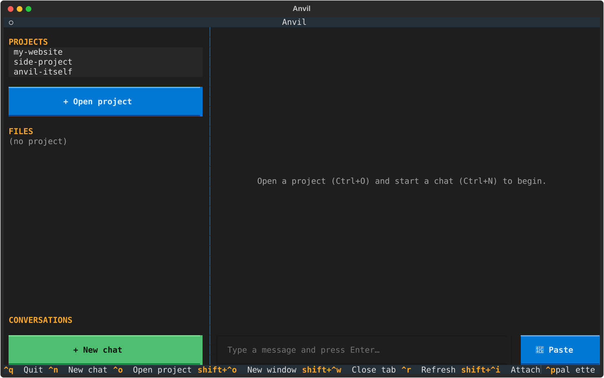
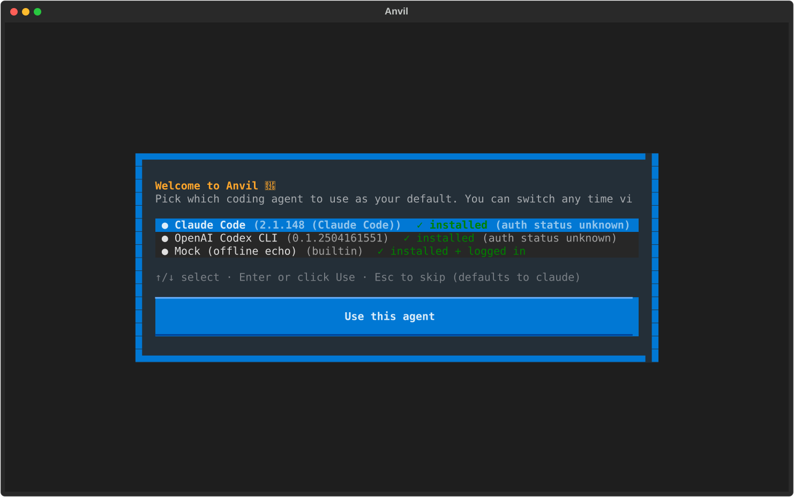
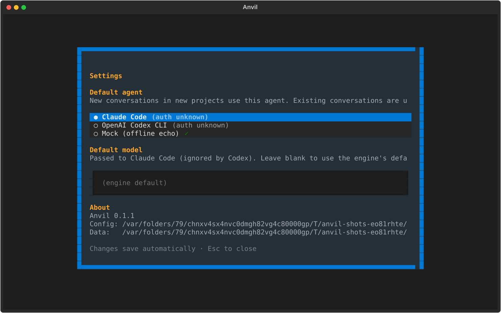

# Anvil

A local TUI for any coding agent — Claude Code, OpenAI Codex, and whatever
comes next. Anvil gives you projects, persistent conversations, file editing,
and cross-conversation memory in one keyboard-driven terminal app.

<p align="center">
  
</p>

<details>
<summary>More screenshots: first-launch wizard · settings</summary>

<p align="center">
  
  <br><br>
  
</p>

</details>

## Why Anvil?

If you use Claude Code or Codex from the CLI, you already know the pain:
each conversation lives in its own terminal window, scrollback is fragile,
attaching images is awkward, and switching between projects means a tangle
of tabs. Anvil keeps the same agents — same auth, same models — but adds
the things a full app gives you:

- **Multiple projects** with their own conversation history and memory.
- **Tabs** for parallel conversations in the same project.
- **A file tree + in-app editor** for small reads/edits without leaving the app.
- **Mac-native shortcuts** (Cmd+C, Cmd+W, Cmd+,) via a custom Terminal profile.
- **Agent-agnostic engine layer** — point a project at Claude Code today,
  Codex tomorrow, or both side-by-side.

Anvil is a wrapper, not a replacement. It uses your existing Claude Code OAuth
or Codex API key — Anvil never sees your tokens.

## Install

**Homebrew (recommended for Mac):**

```bash
brew tap sagar-1199/anvil
brew install --cask anvil
```

This installs the `anvil` CLI and copies `Anvil.app` to `/Applications`.
Launch from Spotlight or the Applications folder.

**Pipx (Mac + Linux):**

```bash
pipx install anvil-harness
anvil
```

You'll also need at least one agent CLI installed (see below).

## Agent setup

Anvil shows a one-time setup wizard on first launch that walks you through
this, but for reference:

| Agent          | Install                                    | Auth                     |
| -------------- | ------------------------------------------ | ------------------------ |
| **Claude Code** | `npm install -g @anthropic-ai/claude-code` | `claude` (OAuth flow)    |
| **Codex CLI**   | `npm install -g @openai/codex`             | `codex login` or set `OPENAI_API_KEY` |
| **Mock**        | (built in)                                 | none — offline echo      |

Anvil never sends your credentials anywhere. It calls your local agent CLI
directly; auth lives wherever those CLIs put it (`~/.claude/`, `~/.codex/`).

## Configuration

Two layers, both edited from the in-app **Settings** screen (Ctrl+, or Cmd+,):

- `~/.anvil/config.toml` — global defaults (agent, model, telemetry opt-in).
- `<project>/.harness/config.toml` — per-project overrides (only fields that
  differ from global).

You should never need to hand-edit these. The Settings screen is the
canonical UI; the files exist so power users can sync them via dotfiles.

## Keyboard

| Shortcut             | Action                          |
| -------------------- | ------------------------------- |
| Ctrl+N               | New chat                        |
| Ctrl+O               | Open project                    |
| Ctrl+,               | Settings                        |
| Ctrl+Shift+M         | Switch agent for current chat   |
| Ctrl+Shift+I         | Attach image                    |
| Ctrl+Shift+V         | Smart paste (text or image)     |
| Ctrl+Shift+W         | Close tab                       |
| Ctrl+S               | Save file (in editor tab)       |

Mac users with the bundled Terminal profile installed get the Cmd+ versions
of these as well (Cmd+W, Cmd+C, Cmd+,).

## Contributing

Want to add support for a new agent (Gemini, Cursor Agent, aider, …)?
See [CONTRIBUTING.md](CONTRIBUTING.md). The agent interface is three methods
and one registration line.

## Development

```bash
git clone https://github.com/sagar-1199/anvil-harness
cd anvil-harness
uv sync
uv run anvil
```

## License

MIT — see [LICENSE](LICENSE).
